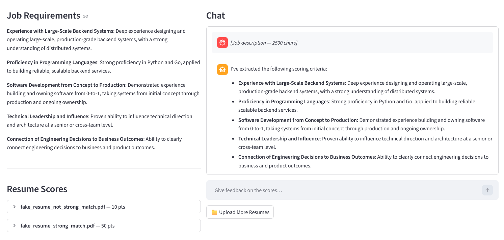

# Hire Panel

An AI-powered resume screening tool built with Streamlit and LangGraph. Upload a job description, let the AI extract scoring criteria, then score candidate resumes — with iterative HR feedback to refine results.



## Features

- **Criteria extraction** — paste a job description and the AI extracts structured scoring criteria; revise them in natural language until satisfied
- **Resume scoring** — upload PDF or TXT resumes; each resume is scored against the criteria with a breakdown of reasons
- **Feedback loop** — give natural-language feedback on scores (e.g. "weight leadership more heavily") and the AI re-scores accordingly, remembering your preferences across rounds
- **Split-panel UI** — job requirements and resume scores on the left, conversational chat interface on the right

## Tech Stack

| Layer | Library |
|---|---|
| UI | Streamlit |
| LLM orchestration | LangGraph |
| LLM provider | OpenAI (via `langchain-openai`) |
| PDF parsing | pdfplumber |
| Data validation | Pydantic |

## Getting Started

**Prerequisites:** Python 3.12+, [uv](https://github.com/astral-sh/uv), an OpenAI API key.

```bash
# Clone and install
git clone <repo-url>
cd hire-panel
uv sync

# Set your API key
export OPENAI_API_KEY=sk-...   # Linux/macOS
$env:OPENAI_API_KEY="sk-..."   # PowerShell

# Run
uv run streamlit run app.py
```

Then open [http://localhost:8501](http://localhost:8501) in your browser.

## Usage

1. Click **Fill JD** and paste the job description
2. Review the extracted criteria in the chat; reply to adjust or type `ok` to confirm
3. Click **Upload Resumes** and select PDF/TXT files
4. Click **Score Resumes** — scores appear on the left panel
5. Give feedback in the chat to re-weight criteria or re-score; upload additional resume batches at any time

## Project Structure

```
hire-panel/
├── app.py              # Streamlit entry point and UI logic
├── pipeline/           # LangGraph pipelines
│   ├── jd_graph.py     # Job description → criteria extraction graph
│   ├── resume_graph.py # Resume scoring graph
│   ├── feedback_graph.py  # Feedback & re-scoring graph
│   ├── state.py        # Shared graph state definitions
│   ├── nodes/          # Individual graph node implementations
│   ├── prompts/        # LLM prompt templates
│   └── schemas/        # Pydantic output schemas
├── tests/
├── pyproject.toml
└── docs/
    └── screenshot.png
```
